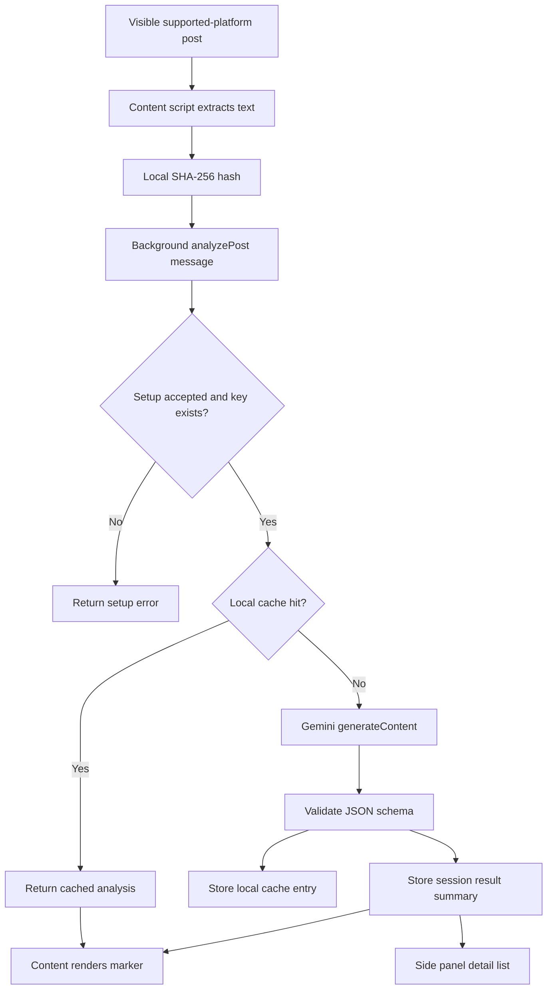

# FeedLens Architecture

## Runtime Components

FeedLens is a Manifest V3 Chrome extension with four runtime surfaces:

1. **Content script**
   - Runs only on `https://www.linkedin.com/*` and `https://x.com/*`.
   - Selects a platform adapter for LinkedIn or X at runtime.
   - Detects visible post-like containers on LinkedIn and supported X home/profile timelines.
   - Extracts human-visible post text and removes common platform UI controls.
   - Hashes post text locally to deduplicate visible posts.
   - Renders inline FeedLens markers and detail popovers.
   - Sends analysis requests to the background service worker.
   - Never reads or receives the Gemini API key.

2. **Background service worker**
   - Owns all Gemini API calls.
   - Reads settings, cache, session results, and API keys from Chrome extension storage.
   - Validates privacy acceptance and key presence before analysis.
   - Calls Gemini `generateContent` with structured JSON output.
   - Validates and normalizes model responses before returning them to the content script.

3. **Popup**
   - Shows setup state and current-tab scan counts.
   - Provides pause/resume, manual analysis, clear visible markers, settings, and side panel commands.

4. **Options page and side panel**
   - Options owns configuration and key entry.
   - Side panel shows session-local analysis details, feedback, hide/copy actions, and re-analysis commands.

## Data Flow



## Storage Model

| Data | Storage | Persistence | Notes |
| --- | --- | --- | --- |
| Settings | `chrome.storage.local` | Persistent | No post text. Customer-facing settings are limited to privacy acceptance. |
| Gemini key | `chrome.storage.local` | Persistent | Stored only in Chrome extension storage on the user's device. |
| Analysis cache | `chrome.storage.local` | Persistent | Stores structured result by hash/model/prompt version, not raw text. |
| Session result list | `chrome.storage.session` | Browser session | Stores result plus short snippet for side panel review. |
| Debug logs | `chrome.storage.session` | Browser session | Development builds only. Stores sanitized event metadata, not raw post text, API keys, Gemini request/response bodies, authors, URLs, snippets, summaries, or evidence quotes. |

## Gemini Integration

The background service worker calls:

```text
POST https://generativelanguage.googleapis.com/v1beta/models/gemini-3.5-flash:generateContent
```

The API key is sent with the `x-goog-api-key` header, not in the URL. The request uses Gemini structured JSON output with the FeedLens schema and the fixed `gemini-3.5-flash` model.

## Scoring Contract

Each analysis result includes:

- `marker`: `green`, `yellow`, or `red`
- `confidence`: `low`, `medium`, or `high`
- `information_quality_score`: 0-100
- `misinformation_risk_score`: 0-100
- `manipulation_pressure_score`: 0-100
- `overall_risk_score`: 0-100
- `signals`: typed evidence objects
- `summary`, `counter_reading`, and `suggested_user_action`

The UI frames results as risk and information-quality signals, not truth rulings or judgments about author intent.

## Build Output

`npm run build` writes a loadable extension to `dist/`.

The build script bundles:

- `assets/background.js` as an MV3 module service worker.
- `assets/content.js` as a single classic content-script bundle.
- `assets/popup.js`, `assets/options.js`, and `assets/sidepanel.js` as page scripts.
- `assets/feedlens.css` as shared extension and content-script CSS.

`npm run build:dev` additionally emits `debug.html` and `assets/debug.js` for local development diagnostics. Production builds do not include the debug page or debug bundle.

No `.env` value is read by the build script, and `.env` files are ignored by git.

## Platform Adapters

FeedLens keeps platform-specific DOM work inside content-script adapters:

- `linkedin`: supports LinkedIn pages using feed/update and feed-list selectors.
- `x`: supports `https://x.com/home` and single-profile timelines such as `https://x.com/example`.

Unsupported X routes such as search, messages, notifications, lists, communities, and individual post detail pages are detected but not scanned. The extension does not use the LinkedIn API or X API, does not auto-scroll, and does not like, repost, comment, connect, follow, message, or post.
